# **Stero Matching PRO** 


<div align="center">

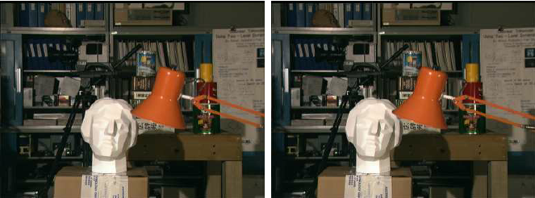

</div>

## **Table of Contents** 
- [**Environment setup**](#environment-setup)
- [**Data**](#data)
- [**Running**](#running)
- [**Reference**](#Reference)

## **Environment setup**
This code was tested with Python 3.8.3.
### Installation

```bash
git clone https://github.com/june65/StereoMatchingPro
pip install -r requirements.txt
```

## **Data**
Middlebury Computer Vision Pages provide datasets and benchmarks for computer vision research, including stereo vision, optical flow, and multi-view stereo. Download datasets at link [here](https://vision.middlebury.edu/stereo/data/scenes2001/). 


## **Running**
### Absolute intensity difference
```bash
python main.py --costmethod AD
```

<div style="display: flex; justify-content: center;">
    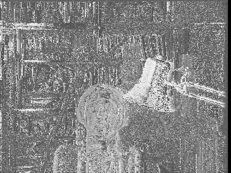
    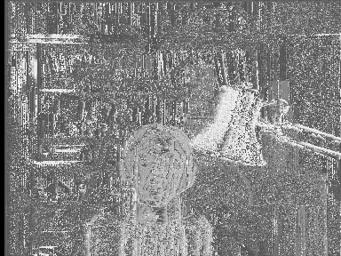
</div>

### Squared intensity difference
```bash
python main.py --costmethod SD
```

<div style="display: flex; justify-content: center;">
    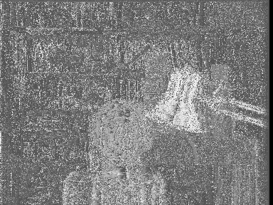
    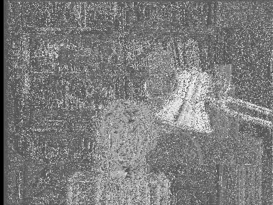
</div>


### Sum of absolute differences
```bash
python main.py --costmethod SAD --costwindow 3
```

<div style="display: flex; justify-content: center;">
    
    
</div>

### Sum of squared differences
```bash
python main.py --costmethod SSD --costwindow 3
```

<div style="display: flex; justify-content: center;">
    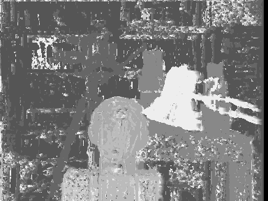
    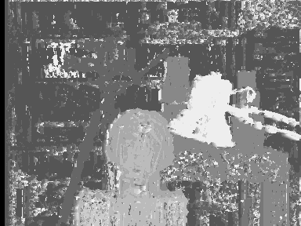
</div>

### Adaptive Support Weights
```bash
python main.py --costmethod ASW --costwindow 33
```

<div style="display: flex; justify-content: center;">
    
    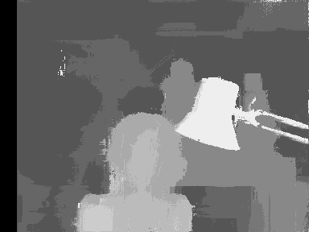
</div>

### Semi-Global Matching
```bash
python main.py --costmethod SGM
```

<div style="display: flex; justify-content: center;">
    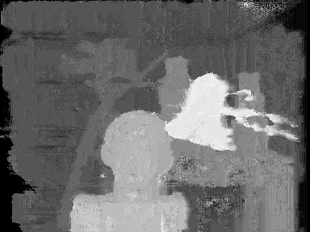
</div>

### Left Right Consistency Check
```bash
python main.py --costmethod SAD --costwindow 3 --lrcheck True
```

<div style="display: flex; justify-content: center;">
    
</div>

### Tree Filtering
```bash
python main.py --costmethod ASW --costwindow 33 --treefilter True --lrcheck True
```


<div style="display: flex; justify-content: center;">
    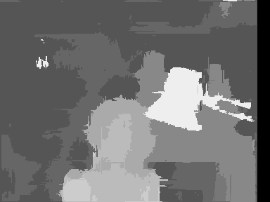
</div>

### Weighted Median Filter
```bash
python main.py --costmethod ASW --costwindow 33 --midfilter 5
```


<div style="display: flex; justify-content: center;">
    
</div>

### Best Result
ASW + Left Right Consistency Check + Tree Filtering + Weighted Median Filter
```bash
python main.py --costmethod ASW --costwindow 33 --lrcheck True --treefilter True --midfilter 5 
```


<div style="display: flex; justify-content: center;">
    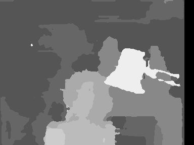
</div>

## **Reference**
[Stereo Matching With Fusing Adaptive Support Weights](https://ieeexplore.ieee.org/document/8712528)

[Stereo Processing by Semi-Global Matching and Mutual Information](https://core.ac.uk/download/pdf/11134866.pdf)

[Stereo Matching Using Tree Filtering](https://ieeexplore.ieee.org/abstract/document/6888475)

[Constant Time Weighted Median Filtering for Stereo Matching](https://openaccess.thecvf.com/content_iccv_2013/papers/Ma_Constant_Time_Weighted_2013_ICCV_paper.pdf)


